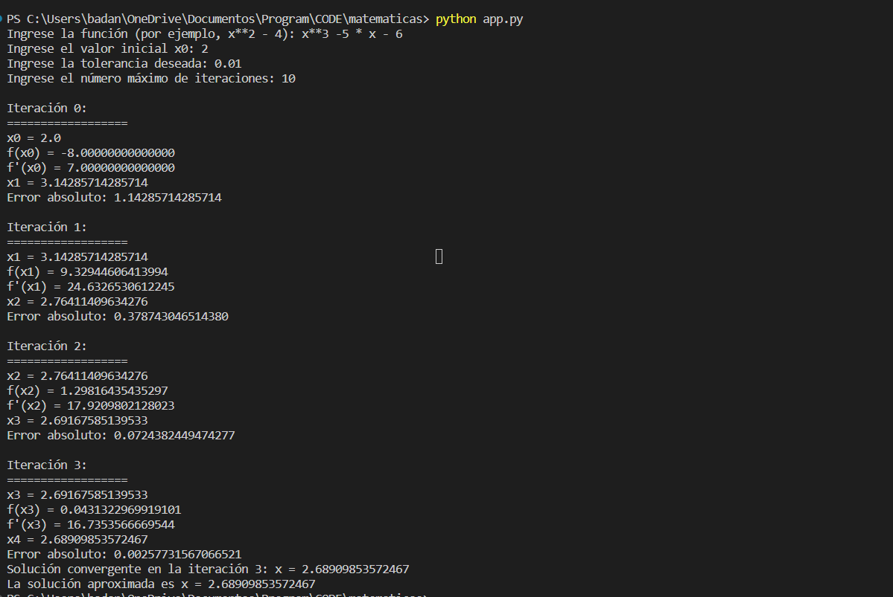

# MetodoNewton_Python
Codigo en Python para Matematicas IV del Methodo de Newton

# Operadores Aritmeticos
Operadores Aritméticos Básicos:
- Adición: Utiliza el operador `+` para sumar dos términos. Ejemplo: `2*x + 3`.
- Sustracción: Utiliza el operador `-` para restar dos términos. Ejemplo: `x - 5`.
- Multiplicación: Utiliza el operador `*` para multiplicar dos términos. Ejemplo: `3*x*2`.
-División: Utiliza el operador `/` para dividir dos términos. Ejemplo: `4*x / 2`.
Potenciación:
- Para elevar un término a una potencia, utiliza el operador `**`. Ejemplo: `x**2` representa x al cuadrado.
Raíces Cuadradas:
- Para calcular la raíz cuadrada de un término, utiliza la notación `sqrt()`. Ejemplo: `sqrt(x)` representa la raíz cuadrada de x.
Funciones Trigonométricas:
- Puedes utilizar funciones trigonométricas como `sin(x)`, `cos(x)`, `tan(x)`, etc. Ejemplo: `sin(x) - cos(x)`.
Funciones Exponenciales y Logaritmos:
- Para expresar funciones exponenciales, utiliza `exp()`. Ejemplo: `2*exp(x)` representa 2e^x.
- Para logaritmos naturales, utiliza `log()`. Ejemplo: `log(x)` representa ln(x).
Paréntesis:
- Utiliza paréntesis para agrupar términos y definir el orden de operaciones. Ejemplo: `(2*x + 3)/(x - 5)`.
Operadores de Comparación:
- Si deseas comparar dos términos, puedes utilizar operadores como `<`, `>`, `<=`, `>=`, `==`, `!=`.
Números Reales:
- Ingresa números reales como `3.14`, `2.5`, `-1.0`, etc.
Símbolos y Variables:
- Utiliza letras o símbolos como variables en tu función, como `x`, `y`, `a`, `b`, etc.
Ejemplos:
1. Ecuación cuadrática con potencia: `x**2 - 9`.
2. Raíz cuadrada: `sqrt(x) - 2`.
3. División: `3*x / (2*x + 1)`.
4. Logaritmo natural: `log(x) - 1`.
5. Función trigonométrica: `sin(x) - cos(x)`.

Ten en cuenta que la aplicación utilizará la notación matemática estándar para evaluar las funciones. Asegúrate de que tu entrada sea coherente con la notación matemática y sigue las reglas de sintaxis matemática para evitar errores en la evaluación de la función.

## Guia de Usuario 
Guía de Usuario: Aplicación del Método de Newton
1.	Inicio de la Aplicación:
   - Asegúrate de que tienes instalado Python y el módulo SymPy en tu entorno de desarrollo.
	Se descarga de este enlace: https://www.python.org/downloads/
	Se instala SymPy con este comando: pip install sympy
   - Ejecuta el programa y se mostrará un mensaje de bienvenida.
	El comando para ejecutar es: python app.py 
2. Ingresar la Función:
   - Debes ingresar una función matemática en la variable `x`, como una expresión algebraica.
   - Ejemplo válido: `x**2 - 4`.
   - Ejemplo no válido (error de sintaxis): `2x + 3`.
   - Ejemplo no válido (función desconocida): `sin(x) / log(x)`.
3. Ingresar el Valor Inicial (x0):
   - Ingresa un número real como valor inicial (x0) para comenzar el cálculo.
   - Ejemplo válido (entero): `5`.
   - Ejemplo no válido (no numérico): `abc`.
   - Ejemplo no válido (fuera de rango): `-3` con un rango mínimo permitido de `0`.
4. Ingresar la Tolerancia Deseada:
   - Ingresa un número real positivo como la tolerancia deseada.
   - Ejemplo válido (decimal): `0.001`.
   - Ejemplo no válido (no numérico): `xyz`.
   - Ejemplo no válido (fuera de rango): `-0.001` con un rango mínimo permitido de `0`.
5. Ingresar el Número Máximo de Iteraciones:
   - Ingresa un número entero positivo como el número máximo de iteraciones permitidas.
   - Ejemplo válido (entero): `10`.
   - Ejemplo no válido (no numérico): `abc`.
   - Ejemplo no válido (fuera de rango): `-5` con un rango mínimo permitido de `1`.
6. Resultados:
   - El programa calculará la solución utilizando el Método de Newton.
   - Mostrará información sobre cada iteración y el resultado final si se encuentra una solución.
   - Si el método no converge, mostrará un mensaje indicando que no se encontró una solución.
Esta guía te ayudará a utilizar la aplicación de manera efectiva, validando las entradas y obteniendo resultados precisos utilizando el Método de Newton para encontrar soluciones a ecuaciones no lineales.

## Ejemplos para ingresar
Ejemplos para ingresar en la aplicación de consola
Ejemplos completos para ingresar en la aplicación, incluyendo la función, el valor inicial, la tolerancia y el número máximo de iteraciones:
1. Funciones Lineales:
   - Función lineal simple: `2*x - 4`.
   - Valor inicial (x0): `1.5`.
   - Tolerancia: `0.0001`.
   - Número máximo de iteraciones: `10`.
2. Funciones Cuadráticas:
   - Ecuación cuadrática simple: `x**2 - 9`.
   - Valor inicial (x0): `3.0`.
   - Tolerancia: `0.001`.
   - Número máximo de iteraciones: `15`.
3. Funciones Trigonométricas:
   - Función trigonométrica simple: `sin(x) - 0.5`.
   - Valor inicial (x0): `1.0`.
   - Tolerancia: `0.0001`.
   - Número máximo de iteraciones: `10`.
4. Funciones Exponenciales:
   - Ecuación exponencial simple: `2*exp(x) - 5`.
   - Valor inicial (x0): `1.0`.
   - Tolerancia: `0.001`.
   - Número máximo de iteraciones: `12`.
5. Funciones Trascendentales:
   - Ecuación trascendental simple: `log(x) - 1`.
   - Valor inicial (x0): `2.0`.
   - Tolerancia: `0.0001`.
   - Número máximo de iteraciones: `10`.
 
6. Ecuaciones que no convergen:
   - Función sin raíces reales: `x**2 + 1`.
   - Valor inicial (x0): `0.5`.
   - Tolerancia: `0.0001`.
   - Número máximo de iteraciones: `15`.

   - Función con raíz múltiple: `(x - 2)**3`.
   - Valor inicial (x0): `2.0`.
   - Tolerancia: `0.001`.
   - Número máximo de iteraciones: `5`.

## Ejemplo de un ejercicio resuelto

